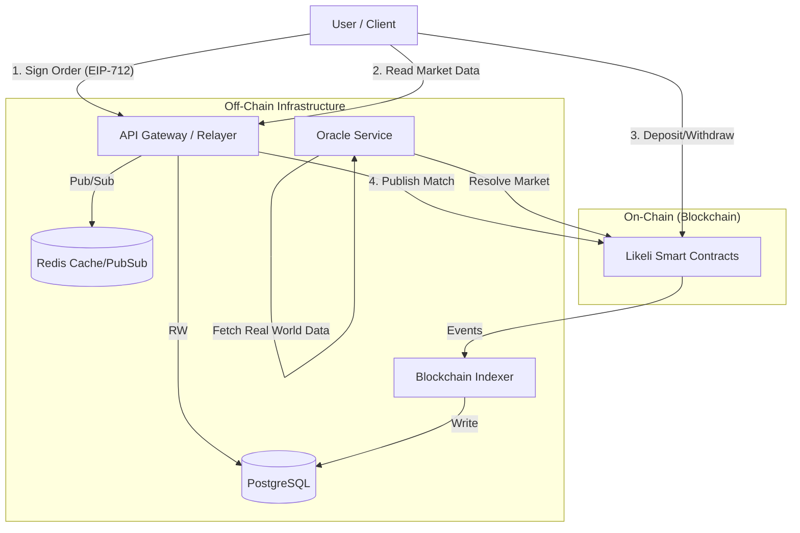

# Backend Services Roadmap

This document outlines the architectural roadmap for transitioning Likeli from its current in-memory/client-side prototype state to a robust, production-ready dApp supported by off-chain services and smart contract integration.

## 1. Current State & Gap Analysis

Currently, the application relies on:
- **Global In-Memory Stores**: `lib/orderbook.ts` and `lib/sandbox.ts` use global variables to store markets, orders, and trades. This state is ephemeral and lost on server restarts.
- **LocalStorage Persistence**: `lib/store.tsx` persists user positions and simulated market data in the browser's `localStorage`. This is insecure, device-specific, and prevents cross-device usage.
- **Simulated Execution**: All trade execution and matching logic happens synchronously in the Next.js API routes or client-side, with no actual blockchain interaction or cryptographic signatures.

### Why this is insufficient for production:
1.  **No Persistence**: Data loss occurs whenever the server creates a new instance (e.g., deployment).
2.  **No Concurrency/Scalability**: In-memory stores cannot share state across multiple API replicas (horizontal scaling).
3.  **Security**: Client-side state (localStorage) can be manipulated by users.
4.  **No "Real" Value**: Without smart contracts, there is no settlement, custody of funds, or trustless execution.

## 2. Proposed Architecture

We propose a Hybrid Decentralized Exchange (DEX) architecture:
- **On-Chain**: Custody of funds, trade settlement, and market resolution logic (Smart Contracts).
- **Off-Chain**: Order book hosting, order matching (Relayer), historical data indexing, and query serving.

### High-Level Components

## 3. Core Services

### 3.1 API & Relayer Service
**Responsibility**: The primary entry point for the frontend to submit orders and fetch aggregated data.
- **Tech Stack**: Node.js (TypeScript), Fastify or NestJS.
- **Order Routing**:
    - Users sign "Limit Orders" using their wallet (EIP-712).
    - These signed orders are sent to the API (Relayer) via HTTP/WebSocket.
    - The Relayer validates balance/approvals and adds the order to the off-chain **Order Book**.
    - **Matching Engine**: When orders cross, the Relayer bundles the Maker and Taker orders and submits a `matchOrders(...)` transaction to the smart contract.
- **Data Serving**: Replaces current Next.js API routes for fetching order books, price history, and user portfolios.

### 3.2 Blockchain Indexer
**Responsibility**: Listen to blockchain events to maintain a queryable state of the truth.
- **Tech Stack**: Node.js Worker (e.g., using `viem` or `ponder`).
- **Events to Index**:
    - `MarketCreated`: Instantiate new market entry in DB.
    - `TradeSettled`: Record confirmed trades, update volume/OHLCV candles.
    - `PositionChanged`: Update user token balances in DB for fast portfolio queries.
    - `MarketResolved`: Mark market as closed, trigger payout calculations in UI.
- **Queue**: Uses a persistent queue (e.g., BullMQ + Redis) to handle event spikes and re-org protection.

### 3.3 Oracle & Resolution Service
**Responsibility**: Fetch off-chain data to resolve markets trustlessly.
- **Tech Stack**: Node.js Cron / Serverless Functions.
- **Flow**:
    - Periodically checks "Active" markets approaching resolution date.
    - Queries trusted data sources (e.g., sports APIs, news APIs, or decentralized oracles like Chainlink/UMA).
    - Pushes resolution data to the Smart Contract.

## 4. Database Schema (PostgreSQL)

We will migrate from in-memory objects to a relational schema.

### Tables

**`users`**
- `address` (PK, Ethereum address)
- `nonce` (for signature replay protection)
- `created_at`

**`markets`**
- `id` (PK, Contract ID)
- `question`, `category`, `rules`, `image_url`
- `resolution_timestamp`
- `status` (OPEN, PAUSED, RESOLVED)
- `outcome_count` (2 for Yes/No)
- `total_volume_usd`

**`orders`** (Off-chain Order Book)
- `hash` (PK, EIP-712 hash)
- `market_id` (FK)
- `maker_address` (FK)
- `side` (BUY/SELL)
- `price`, `size_original`, `size_remaining`
- `signature`
- `status` (OPEN, FILLED, CANCELLED, EXPIRED)
- `expiry_timestamp`

**`trades`** (On-chain History)
- `tx_hash` (PK)
- `market_id` (FK)
- `maker_order_hash` (FK)
- `taker_address`
- `price`, `size`
- `timestamp`

**`price_history`** (Time-series)
- `market_id` (FK)
- `bucket` (1m, 1h, 1d)
- `open`, `high`, `low`, `close`, `volume`
- `timestamp`

**`portfolio_snapshots`**
- `user_address`
- `timestamp`
- `total_equity_usd`
- `pnl_daily`

## 5. Interactions & Data Flow

### A. Market Discovery (Read)
1. Frontend requests `GET /api/v1/markets`.
2. API queries `markets` table in Postgres (cached in Redis).
3. Returns list with volume, current probability (from latest order book mid-price).

### B. Placing an Order (Write)
1. User clicks "Buy YES".
2. Wallet prompts to sign typed data: `Permit(market, outcome, price, nonce, expiry)`.
3. Frontend `POST /api/v1/orders` with signature.
4. **Relayer**:
   - Recovers signer address.
   - Checks DB for order validity (nonce, expiry).
   - Checks on-chain allowance (RPC call).
   - Inserts into `orders` table.
   - Runs matching algorithm.
   - If match found -> Submits TX to blockchain.

### C. Settlement (Indexer)
1. Blockchain confirms `TradeSettled` event.
2. **Indexer** picks up event.
3. Updates `trades` table.
4. Updates `orders` status (e.g., partial fill or full fill).
5. Updates `price_history` for charts.

## 6. Migration Steps

### Phase 1: Database Foundation
1. Spin up PostgreSQL and Redis instances.
2. Implement Prisma or Drizzle ORM schema based on the design above.
3. Create the **Indexer** service to listen to the *testnet* contracts (even if simple mocks).

### Phase 2: Dual Write (Hybrid)
1. Modify current Next.js API routes (`src/app/api/...`) to write to Postgres *in addition* to the in-memory store.
2. Use this to validate schema correctness without breaking the UI.

### Phase 3: The Switch
1. Update `src/lib/orderbook.ts` to fetch from the API Service (or direct DB) instead of memory.
2. Remove `localStorage` logic in `store.tsx` for critical data; keep it only for UI preferences (theme, etc.).
3. Point Frontend to the new Node.js API Service.

### Phase 4: Production Hardening
1. Implement Rate Limiting on the API.
2. Set up Cron jobs for `price_history` aggregation (convert raw trades to OHLCV).
3. Deploy Admin Dashboard for manual market resolution (fallback mechanism).
